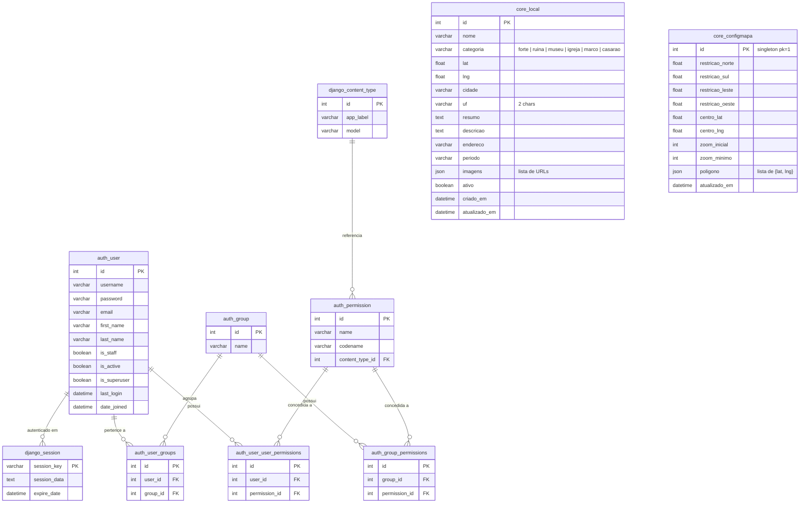

# Diagrama de Relacionamento — Banco de Dados

## Notas

| Tabela | Descrição |
|---|---|
| `core_local` | Pontos do mapa (históricos). Sem FK — autônomo. |
| `core_configmapa` | Singleton (sempre `id = 1`). Guarda os limites do mapa, centro, zoom e polígono da região. |
| `auth_user` | Usuários Django. Apenas usuários com `is_staff = true` acessam a área administrativa. |
| `django_session` | Sessões de login; não há FK explícita, mas o middleware associa sessão ao usuário. |
